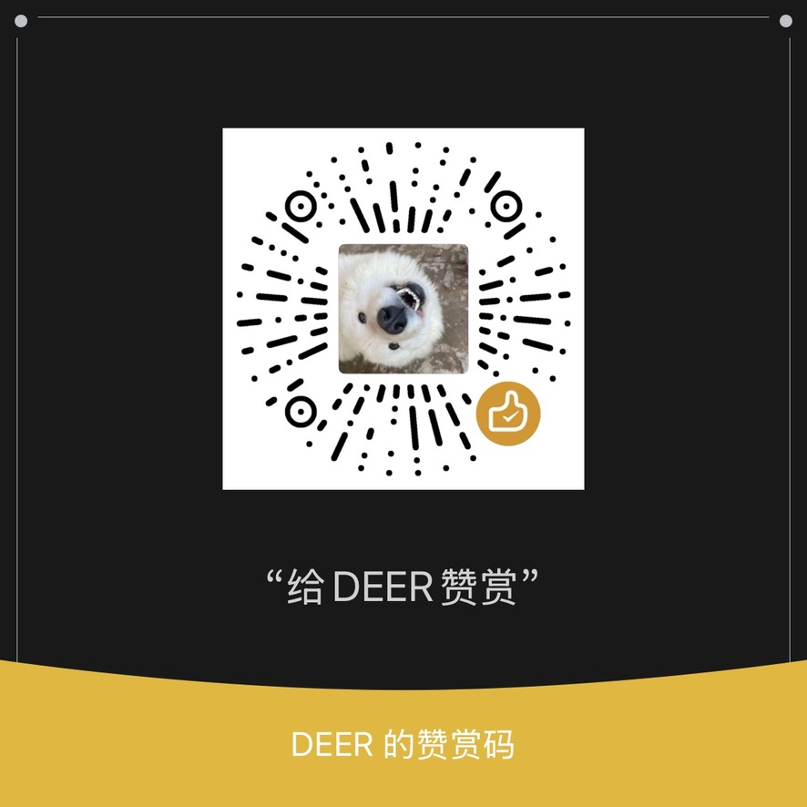

# Bookmark Nav

A simple bookmark directory with a clean public page and a full administration interface. Your data stays in your own Cloudflare account. The browser extension adds one-click saving and AI autofill.


## Documentation

- [Project and deployment](./docs/project.md): features, Cloudflare deployment, updates, and license
- [Browser extension](./docs/extension.md): installation, configuration, everyday use, AI, and development
- [Development](./docs/development.md): stack, architecture, local setup, and conventions
- [Command reference](./docs/commands.md): npm, Wrangler, Drizzle, and WXT commands
- [Packaging and publishing](./docs/publishing.md): Chrome Web Store, Firefox AMO, and WXT publishing
- [Known limitations](./docs/limitations.md): limitations, recommendations, and roadmap

## Quick start

```bash
npm install
cp .dev.vars.example .dev.vars   # Set JWT_SECRET to a random string
npx wrangler d1 migrations apply DB --local
npm run dev                      # http://localhost:5173
```

## Buy me a coffee

If you find this project useful, you can support its development!

<table>
  <tr>
    <td align="center">
      <strong>WeChat Pay</strong><br>
      
    </td>
    <td align="center">
      <strong>Alipay</strong><br>
      
    </td>
    <td align="center">
      <strong>Reward code</strong><br>
      
    </td>
  </tr>
</table>

Thank you to everyone who supports the project!

## License

[GPL-3.0](./LICENSE)
