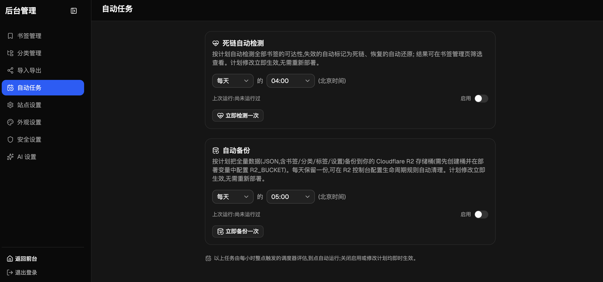

# 项目说明与部署

## 项目简介

多功能简洁书签导航站。前台是一个干净的公开导航页,后台提供完整的书签管理能力,数据完全存放在你自己的 Cloudflare 账号里。

## 功能特性

- 📌 **前台导航页**:分类分组展示、置顶、点击计数、实时搜索(⌘K / `/` 快捷键)、深色/浅色/跟随系统主题、前台主题切换按钮
- 🧩 **浏览器插件**:一键收藏当前网页(自动预填标题/去重提示/私密开关/标签/分类),右键菜单收藏任意链接;若后台配置了 AI,popup 内提供「AI 智能填充」一键补全标题/描述/标签/分类。插件凭后台「安全」页生成的**访问令牌**跨域调用 API(明文仅生成时显示一次,库中只存 SHA-256;改密码自动吊销)。详见 [extension.md](./extension.md)
- 🎨 **界面风格**:经典卡片 / 液态玻璃(半透明悬浮胶囊 + 渐变背景)后台一键切换
- 🗂 **多级分类**:分类无限嵌套,支持拖拽排序、批量删除(级联)
- 🔒 **私密书签**:书签和分类均可设为私密,仅登录后可见;私密分类整棵子树对外隐藏
- 📥 **导入导出**:兼容 Chrome / Edge / Firefox 的 HTML 书签格式,多级文件夹结构完整保留,导入导出可互相往返
- 🔗 **死链检测**:每晚定时自动检测全量书签并自动标记/恢复,后台也可手动分批检测
- 💾 **自动备份**:可选开启,每晚自动把全量数据(JSON)备份到你的 Cloudflare R2 存储桶,后台可随时手动备份
- ✂️ **批量操作**:书签批量移动分类、批量删除;分类多选全选
- 🏷 **标签**:书签支持多标签,搜索时一并匹配
- 🧩 **图标**:自定义图标 / 图标服务;加载失败自动回退为「首字母 + 稳定配色」占位块
- 📝 **自定义页脚**:支持 Markdown(链接、加粗、斜体),防注入白名单渲染
- 🖥 **站点名称全局生效**:前台页头与浏览器标签页标题自动跟随
- 📱 **移动端适配**:前后台均适配小屏幕

## 部署

1. 点击本仓库右上角 **Fork**
2. 在 [Cloudflare 控制台](https://dash.cloudflare.com) → **存储和数据库 → D1** → 创建数据库(名称随意,如 `bookmark-nav-db`),复制其**数据库 ID**
3. 控制台 → **Workers 和 Pages → 创建 → 导入存储库**,选择你 fork 的仓库,构建配置(下面都要填,不能留默认值):
   - 构建命令:`npm run build`
   - 部署命令:`npm run deploy`
   - 构建变量 `D1_DATABASE_ID`:值为第 2 步复制的数据库 ID
   - 构建变量 `JWT_SECRET`:登录会话签名密钥,填随机长字符串(可用 `openssl rand -hex 32` 生成),建议勾选“加密”
   - 构建变量 `R2_BUCKET`(可选):填写一个 R2 存储桶名称(先在「存储和数据库 → R2」创建,如 `bookmark-nav-backup`),开启自动备份功能——全量数据 JSON 每天存入该桶,默认每天北京时间 05:00 运行,频率与时间可在后台「自动任务」页随时调整。不设置则不开备份,部署不受影响
4. 访问 Worker 域名,首次打开会引导你创建管理员账号

> 为什么 `JWT_SECRET` 放在**构建变量**而不是 Worker 的“变量和机密”:通过 GitHub 集成部署时,每次 `wrangler deploy` 会清空面板上手动添加的机密([cloudflare/workers-sdk#8871](https://github.com/cloudflare/workers-sdk/issues/8871)),导致登录报错;放在构建变量则会在构建时自动注入,每次部署都带上,永不丢失。

> Fork 部署不需要修改仓库里的任何文件(配置均通过构建变量在部署时自动注入),你的 fork 与本仓库永远保持零差异,因此可以随时用 GitHub 的 **Sync fork** 按钮一键同步新版本。

## 更新版本

在你 fork 的仓库页面点 **Sync fork → Update branch**,同步后 Cloudflare 自动重新构建部署,完成。

> 注意:`deploy` 脚本中的 `db:migrate` 使用的库名(`bookmark-nav-db`)与 `wrangler.json` 的 `database_name` 保持一致。若你改过该名称,请相应调整命令中的库名。

## 许可证

[GPL-3.0](../LICENSE)
